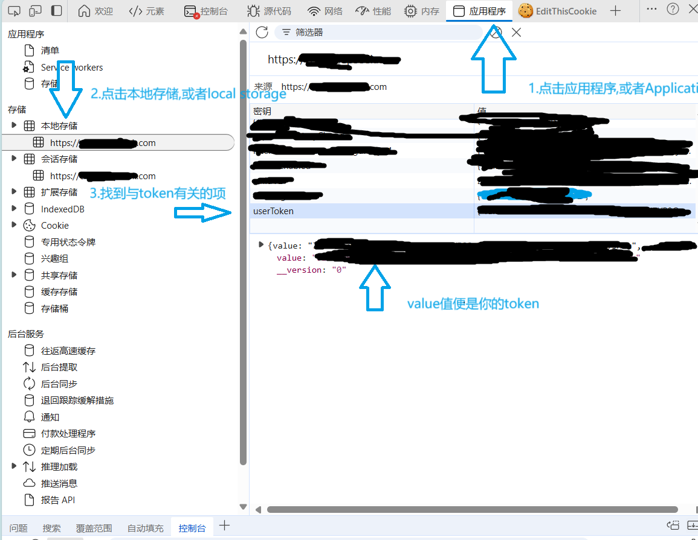
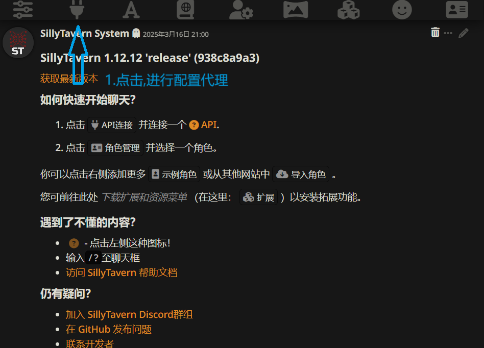
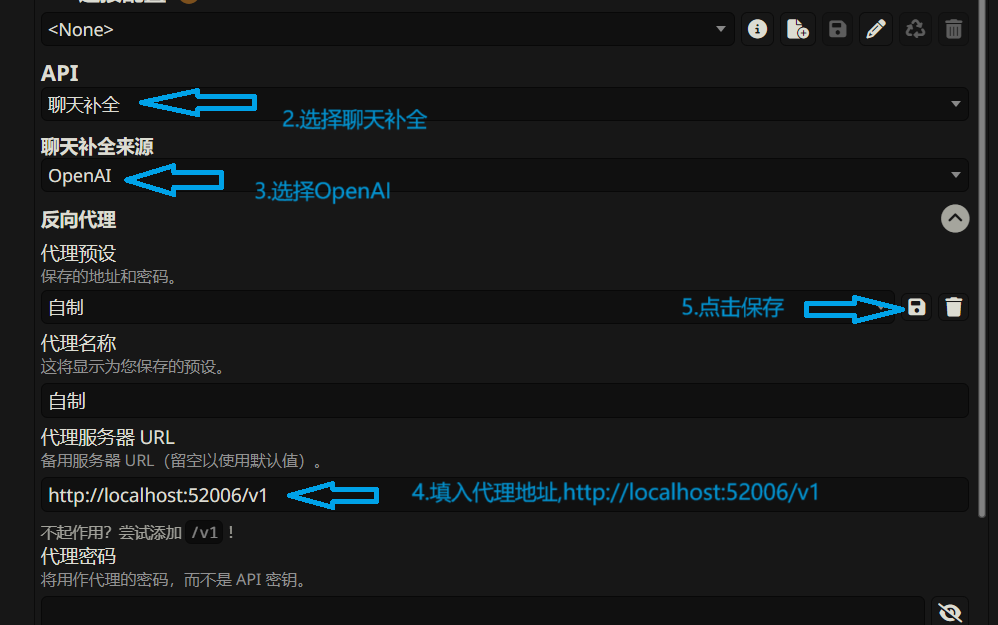
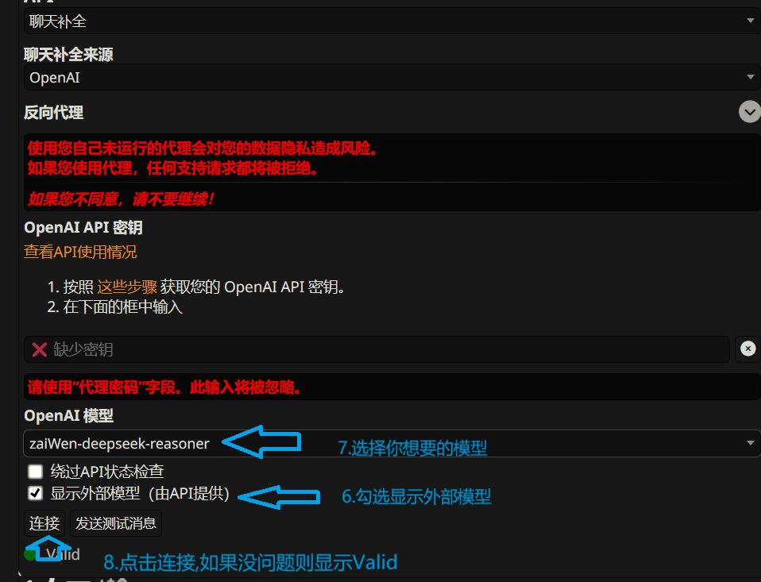

# SillyTavernProxy

[]
## 项目简介

SillyTavernProxy 是一款自制的 SillyTavern 代理，旨在通过接入某些 AI 镜像网站的接口，为用户提供无需API密钥即可体验SillyTavern功能的方式。目前暂时仅支持两个AI镜像网站

## 免责声明

**重要提示:** 本项目仅供个人学习、研究和交流使用，**严禁用于商业用途或对外提供任何形式的服务**。作者不接受任何形式的捐赠或交易。

**法律风险:** 本项目接入了第三方AI镜像网站的部分接口。用户明确了解并同意，使用本项目可能存在违反第三方服务条款和相关法律法规的风险。**所有使用本项目产生的风险和后果均由用户自行承担，与本项目作者无关。**

**服务器压力:** 请合理使用本项目，**禁止对官方服务器或第三方 AI 镜像网站服务器造成过大的压力**。过度使用可能导致服务中断或其他不良后果，用户需自行承担责任。

**作者不承担任何责任:** 对于因使用本项目导致的任何直接或间接损失，包括但不限于数据丢失、服务中断、法律纠纷等，作者概不负责。

## Linux端部署和使用

### 推荐使用docker部署

#### docker部署方法

#### 安装docker(如果你已经安装了,可以跳过)
```bash
# 安装docker
curl -fsSL https://get.docker.com -o get-docker.sh
sudo sh get-docker.sh

# 安装docker-compose
apt update
apt install docker-compose-plugin

#启动docker
systemctl start docker

# 设置docker开机自启
systemctl enable docker
```

#### 拉取项目相关文件
```bash
# 下载打包好的文件
wget https://github.com/The-Falling-star/SillyTavernProxy/releases/download/v2.0/SillyTavernProxy.jar

# 下载docker相关文件文件
wget https://github.com/The-Falling-star/SillyTavernProxy/releases/download/v2.0/docker-compose.yml
wget https://github.com/The-Falling-star/SillyTavernProxy/releases/download/v2.0/Dockerfile

# 下载配置文件
wget https://github.com/The-Falling-star/SillyTavernProxy/releases/download/v2.0/application.yml
```
#### 启动项目
``` bash
# 后台启动项目
docker-compose up -d --build

# docker-compose up -d # 如果文件没有更新的话
# docker-compose up --build # 需要前台启动的话
```
<br>

### 直接部署

#### 前置条件
*   Java 21 或更高版本(如果没有安装java,请自行上网查找java21的安装教程)
*   Maven (用于构建项目,如果下载好jar包则不需要)
*   部分模型要求安装redis,否则无法正常运行

#### 安装Java21 (如果已经安装则跳过)
```bash
sudo apt update
sudo apt install openjdk-21-jdk

# 验证是否安装成功,如果显示类似openjdk version "21.0.0"的信息说明成功
java -version
```

#### 安装redis (如果已经安装则跳过)
```bash
sudo apt install redis-server
```

#### 构建项目 (如果是自己下载好了jar包则跳过)

1.  克隆项目代码：

    ```bash
    git clone https://github.com/The-Falling-star/SillyTavernProxy
    cd SillyTavernProxy
    ```

2.  使用 Maven 构建项目：

    ```bash
    mvn clean package
    ```

    构建成功后，在 `target/` 目录下会生成可执行的 JAR 文件。


#### 配置项目
```bash
# 下载配置文件
wget https://github.com/The-Falling-star/SillyTavernProxy/releases/download/v2.0/application.yml

# 打开配置文件
vim application.yml
```
#### 进入一个AI镜像网站,按下F12打开开发者工具,找到`token`


#### 随后在tokens中填入你的token,支持多个token,示例:
```yaml
deepseek:
  tokens:
    - Bearer your deepseek token1
    - Bearer your deepseek token2
```

#### 配置redis
```yaml
spring:
  codec:
    max-in-memory-size: 20MB
  profiles:
    active: dev
  data:
    redis:
      host: 127.0.0.1 # 在此处填入你的redis地址
      port: 6379 # 在此处填入你的redis端口
```

#### 运行项目 

```bash
#启动redis
nohup redis-server &

# 以下两条指令二选一执行
# 如果你是从github直接下载的jar包(即跳过了构建项目的步骤)
java -jar SillyTavernProxy.jar

# 如果你是自行构建的项目
java -jar target/SillyTavernProxy.jar
```

## Windows部署和使用
### 推荐使用docker部署
### docker部署教程
> 前往 https://www.docker.com/ 下载docker安装包并安装(可能需要科学上网)
> 
> 前往 https://github.com/The-Falling-star/SillyTavernProxy/releases 下载application.yml,SillyTavernProxy.jar,Dockerfile,docker-compose.yml四个文件,并放在同一目录下
>
> 按照上述Linux环境部署教程以获取token,打开application.yml,在对应的位置填入你的token
> 
> 打开刚安装好的 Docker Desktop,在刚才下载的四个文件的目录下打开cmd,输入`docker-compose --build`启动项目

### 直接部署
> 自行上网搜索安装Java 21的教程来安装Java 21
> 
> 自行上网搜索安装Windows版的redis来安装redis
> 
> 前往 https://github.com/The-Falling-star/SillyTavernProxy/releases 下载application.yml,SillyTavernProxy.jar两个文件,并放在同一目录下
>
> 按照上述Linux环境部署教程以获取token,打开application.yml,在对应的位置填入你的token
>
> 随后输入以下指令启动项目
 ```bash
# 启动redis
redis-server

# 启动项目
java -jar SillyTavernProxy.jar
```

## 安卓端部署
### 前置条件
* 手机已经安装好了Termux
* Termux里已经安装好了ubuntu系统

#### 安装Java21 (如果已经安装则跳过)
```bash
sudo apt update
sudo apt install openjdk-21-jdk

# 验证是否安装成功,如果显示类似openjdk version "21.0.0"的信息说明成功
java -version
```

#### 安装redis (如果已经安装则跳过)
```bash
sudo apt install redis-server
```

#### 配置项目
```bash
# 下载配置文件
wget https://github.com/The-Falling-star/SillyTavernProxy/releases/download/v2.0/application.yml

# 按照上述Linux环境部署教程以获取token
# 打开配置文件,并在对应位置填入你的token,并配置redis
vim application.yml
```
#### 填入token,示例:
```yaml
deepseek:
  tokens:
    - Bearer your deepseek token1
    - Bearer your deepseek token2
```

#### 配置redis
```yaml
spring:
  codec:
    max-in-memory-size: 20MB
  profiles:
    active: dev
  data:
    redis:
      host: 127.0.0.1 # 在此处填入你的redis地址
      port: 6379 # 在此处填入你的redis端口
```

### 运行项目

```bash
#启动redis
nohup redis-server &

# 以下两条指令二选一执行
# 如果你是从github直接下载的jar包(即跳过了构建项目的步骤)
java -jar SillyTavernProxy.jar

# 如果你是自行构建的项目
java -jar target/SillyTavernProxy.jar
```

默认端口是52006

## SillyTavern配置教程
#### 1.进行代理配置


#### 2.填写信息


#### 3.进行连接


#### 4.好了,现在你配置完了一切,开始对话吧


## 许可证

本项目采用 [GNU Affero General Public License v3.0](LICENSE) 许可。

再次强调：请仔细阅读并理解免责声明。使用本项目即表示你同意承担所有相关风险和责任。
